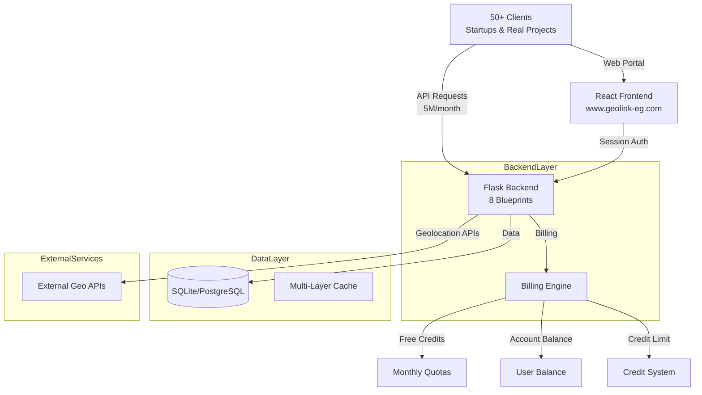
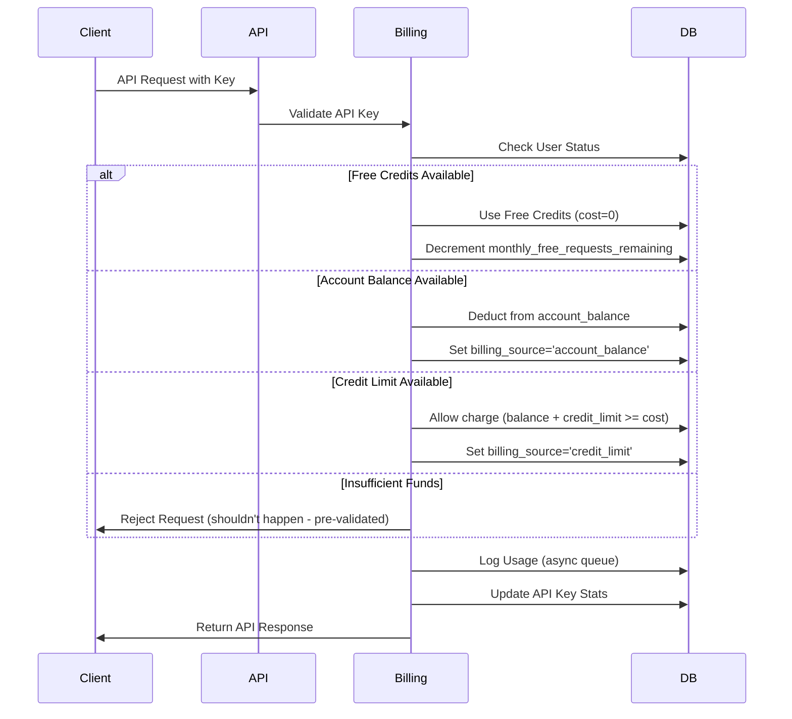
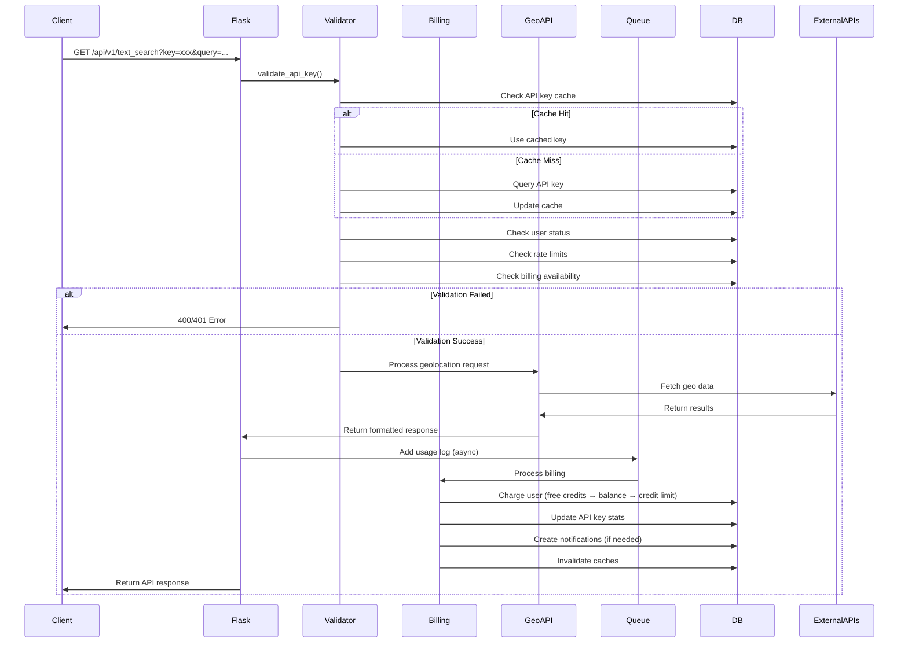
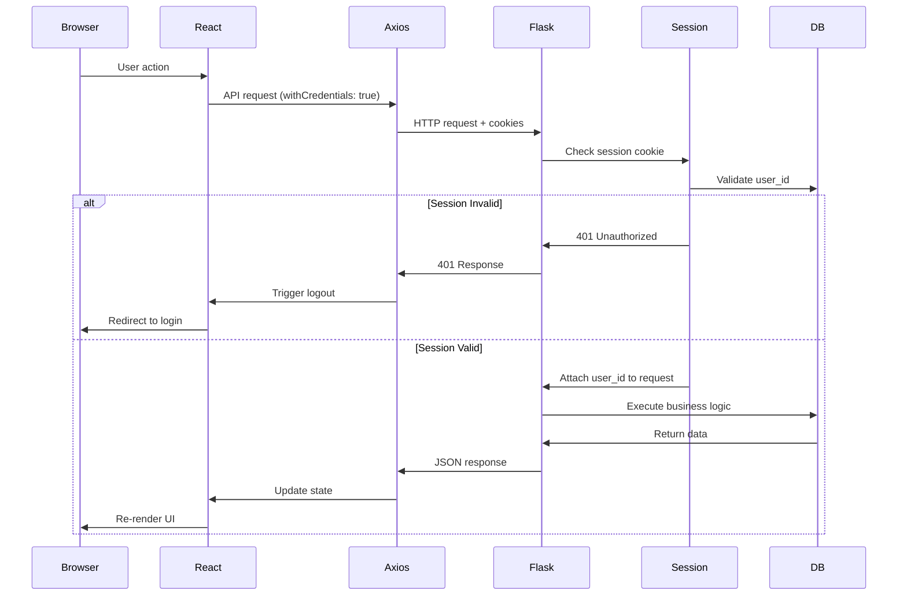

# 🌐 GeoLink V1 - Production Geolocation API Platform

> **Production-Ready Full-Stack Platform: 5M+ Requests/Month, Serving 50+ Clients**

```
╔══════════════════════════════════════════════════════════════╗
║                                                              ║
║         GEOLINK V1 - PRODUCTION API PLATFORM                  ║
║                                                              ║
║     Full-Stack Geolocation Services with Billing System      ║
║                                                              ║
╚══════════════════════════════════════════════════════════════╝
```

## 🌟 Project Overview

**Production URL:** www.geolink-eg.com  
**Status:** Production System (Public API)  
**Traffic:** ~5 million requests per month  
**Client Base:** 50+ clients (startups, real projects, developers)  
**Created:** February 2024  
**Last Updated:** November 2025  
**Repository Location:** `e:/BackUp/geo/geolink`  
**Complexity:** ⭐⭐⭐⭐⭐ (Highest - Production API Platform)

### **Core Description**

> "Production-ready geolocation API service platform providing text search, directions, geocoding, and reverse geocoding services. Built with Flask and React, featuring comprehensive user management, credit-based billing system, API key management, and admin dashboard. Handles 5M+ requests monthly for 50+ production clients."

### **Production Metrics**

- **Monthly Traffic:** ~5 million API requests
- **Active Clients:** 50+ (startups, real projects, developers)
- **Uptime:** Production system with high availability
- **Performance:** Optimized for scale with caching, connection pooling, async processing
- **Billing System:** Credit-based with free monthly quotas, account balance, and payment processing

---

## 🏗️ Architecture

### **System Architecture**



### **Technology Stack**

**Backend:**
- **Framework:** Flask 3.0.3
- **ORM:** SQLAlchemy 2.0.44+
- **Database:** SQLite (dev), PostgreSQL-ready (production)
- **Authentication:** Session-based (web) + API key-based (APIs)
- **Password Security:** PBKDF2-SHA256 (50,000 iterations)
- **Production Servers:**
  - Linux: Gunicorn 21.2.0 (multi-process + gthread workers)
  - Windows: Waitress 2.1.2 (multi-threaded)
- **HTTP Client:** Requests 2.32.3 with Fake-UserAgent
- **Utilities:** Flask-CORS, Flask-Compress, Python-Dotenv, PSUtil

**Frontend:**
- **Framework:** React 18.3.1
- **Build Tool:** Vite 6.0.3
- **HTTP Client:** Axios 1.7.9 (with credentials/cookies)
- **Routing:** React Router 7.1.3
- **Styling:** Tailwind CSS 3.4.17
- **UI Libraries:**
  - Lucide React 0.469.0 (Icons)
  - Recharts 2.15.0 (Charts)
  - React Leaflet 4.2.1 (Maps)
  - React Hot Toast 2.5.1 (Notifications)
  - Framer Motion 11.0.8 (Animations)
- **State Management:** Context API (AuthProvider, UserContext, PaymentsContext, NotificationsContext)

**Database:**
- **Development:** SQLite with WAL mode and pragma optimizations
- **Production:** PostgreSQL or MySQL with connection pooling
- **Location:** `storage/data/api_platform.db` (SQLite)
- **Optimization:** Composite indexes, query caching (5-min), connection pooling (pool_size=20, max_overflow=30)

---

## 📊 Backend Architecture Deep Dive

### **Flask Blueprint Architecture**

**8 Blueprints:**

1. **`api_bp`** (`/api/v1`) - Geolocation APIs v1
   - Text search, directions, geocoding, reverse geocoding
   - Distance matrix calculations
   - Generic API request processor

2. **`api_v2_bp`** (`/api/v2`) - Optimized geolocation APIs v2
   - Enhanced performance versions
   - Optimized direction calculations

3. **`auth_bp`** (`/auth`) - Authentication endpoints
   - Registration, login, logout
   - Password reset with OTP (6-digit, 15-min expiry)
   - Session management

4. **`user_bp`** (`/user`) - User management
   - Profile management
   - API key management (create, regenerate, deactivate)
   - Usage statistics
   - Unified dashboard endpoint (10x faster - single request)

5. **`payment_bp`** (`/payment`) - Payment processing
   - Payment methods (Vodafone Cash, Instapay, Bank Transfer)
   - Payment history
   - Account balance

6. **`admin_bp`** (`/admin`) - Admin panel
   - User management (list, details, status updates)
   - Payment approval/rejection
   - System settings configuration
   - System-wide statistics

7. **`backup_bp`** (`/admin/backup`) - Backup endpoints (DEBUG only)
   - Database backup utilities

8. **`debug_bp`** (`/api/v1`) - Debug endpoints (DEBUG only)
   - Performance metrics
   - System diagnostics

### **Database Models (8 Core Entities)**

**1. User**
- **Purpose:** Registered users with authentication and billing
- **Key Fields:** `phone_number` (unique), `email` (unique), `password_hash`, `account_balance`, `monthly_free_requests_remaining`, `is_suspended`
- **User Types:** `FREELANCER`, `COMPANY` (enum)
- **Relationships:** `api_keys`, `usage_logs`, `payments`, `notifications`, `password_resets`
- **Methods:** `refresh_monthly_credits()`, `check_request_availability()`, `log_usage()`

**2. APIKey**
- **Purpose:** API authentication and rate limiting
- **Key Fields:** `key` (UUID), `daily_request_limit`, `requests_today`, `total_requests`, `total_cost`, `is_active`
- **Caching:** LRU cache (10,000 keys, 5-min timeout)
- **Methods:** `validate()`, `regenerate()`, `deactivate()`, `check_rate_limit()`

**3. UsageLog**
- **Purpose:** Records every API request with billing details
- **Key Fields:** `endpoint`, `timestamp`, `ip_address`, `cost`, `response_time_ms`, `success`, `billing_source`
- **Billing Sources:** `free_credits`, `account_balance`, `credit_limit`
- **Indexes:** Composite on `(user_id, endpoint, timestamp)`

**4. Payment**
- **Purpose:** Payment request management
- **Key Fields:** `amount`, `method`, `transaction_reference`, `status`, `admin_comment`
- **Methods:** `VODAFONE_CASH`, `INSTAPAY`, `BANK_TRANSFER`
- **Statuses:** `PENDING`, `APPROVED`, `REJECTED`

**5. SystemSettings**
- **Purpose:** Global configuration (single record)
- **Key Fields:** `monthly_free_requests`, `daily_request_limit`, `cost_per_request`, `credit_limit`, `reset_day` (1-28)
- **Caching:** Thread-local storage (5-min timeout)

**6. EndpointPricing**
- **Purpose:** Custom pricing per endpoint
- **Key Fields:** `endpoint`, `cost`, `description`
- **Caching:** LRU cache (1,024 entries)

**7. Notification**
- **Purpose:** In-app user notifications
- **Key Fields:** `title`, `message`, `type`, `is_read`
- **Types:** `info`, `success`, `warning`, `error`

**8. PasswordReset**
- **Purpose:** OTP-based password recovery
- **Key Fields:** `otp` (6-digit), `expires_at` (15-min expiry), `used`

### **Billing System Architecture**

**Billing Flow Priority:**



**Billing Components:**

1. **Free Credits System:**
   - Monthly quota (default: 3,000 requests)
   - Auto-refresh on configured reset day (1-28)
   - Priority billing source (cost = 0)

2. **Account Balance:**
   - User's paid funds
   - Deducted after free credits exhausted
   - Can go negative up to credit limit

3. **Credit Limit:**
   - Minimum allowed balance (default: -500 EGP)
   - Allows negative balance for flexibility
   - Account suspended when balance < credit limit

4. **Payment Processing:**
   - User submits payment request
   - Admin approves/rejects
   - Balance updated on approval
   - Account unsuspended if balance >= 0

### **Caching Strategy**

**Multi-Layer Caching:**

1. **API Key Cache** (models.py)
   - **Size:** 10,000 keys
   - **TTL:** 5 minutes
   - **Eviction:** LRU (removes oldest 25% when full)
   - **Invalidation:** On deactivate/regenerate operations

2. **Endpoint Pricing Cache** (utils/api_keys.py)
   - **Size:** 1,000 endpoints
   - **TTL:** 5 minutes
   - **Eviction:** LRU (removes oldest 25% when full)
   - **Invalidation:** On admin pricing updates

3. **System Settings Cache** (models.py)
   - **Storage:** Thread-local
   - **TTL:** 5 minutes
   - **Scope:** Per-thread
   - **Invalidation:** On admin settings updates

4. **User Stats Cache** (utils/user_serializers.py)
   - **Size:** 100 users
   - **TTL:** 5 minutes
   - **Eviction:** LRU
   - **Invalidation:** On usage log creation, payment approval

5. **Payment Methods Cache** (routes/payment_routes.py)
   - **Storage:** Thread-local dictionary
   - **TTL:** 5 minutes
   - **Invalidation:** On system settings update

### **Background Processing**

**Async Log Queue Worker** (utils/api_keys.py):

```python
# Queue-based async logging
_log_queue = queue.Queue()

def log_processor_worker():
    """
    Background thread that processes usage logs asynchronously.
    
    Features:
    - Prevents blocking API responses
    - Batches database writes
    - Retry logic on database locks
    - Creates notifications (low balance, suspension)
    - Invalidates caches after writes
    """
    while True:
        try:
            log_data = _log_queue.get(timeout=1)
            # Process log, charge user, create notifications
            _log_queue.task_done()
        except queue.Empty:
            continue
```

**Benefits:**
- Non-blocking API responses
- Automatic retry on database locks
- Notification creation (low balance warnings, suspensions)
- Cache invalidation after writes

### **Database Connection Management**

**Connection Pooling** (app.py):

```python
# Pool configuration
pool_size=20              # 20 persistent connections
max_overflow=30           # 30 additional on-demand connections
pool_timeout=30           # 30s wait for available connection
pool_recycle=300          # Recycle connections after 5 minutes
pool_pre_ping=True        # Verify connection before use (MySQL)
```

**Transaction Management** (utils/database.py):

```python
def execute_in_transaction(session_factory, callback, max_retries=3):
    """
    Wraps database operations in transaction with retry logic.
    
    Features:
    - Automatic commit on success
    - Automatic rollback on error
    - Exponential backoff for database locks (0.1s * 2^retry)
    - SQLite concurrency handling
    - Connection cleanup in finally block
    """
    for attempt in range(max_retries):
        session = session_factory()
        try:
            result = callback(session)
            session.commit()
            return result
        except OperationalError as e:
            session.rollback()
            if attempt < max_retries - 1:
                time.sleep(0.1 * (2 ** attempt))
            else:
                raise
        finally:
            session.close()
```

---

## 🎨 Frontend Architecture Deep Dive

### **React Application Structure**

**Provider Hierarchy** (App.jsx):

```jsx
<EndpointsProvider>
  <AuthProvider>
    <UserContextProvider>
      <PaymentsContextProvider>
        <NotificationsProvider>
          <Router>
            <Routes>
              {/* All routes */}
            </Routes>
          </Router>
        </NotificationsProvider>
      </PaymentsContextProvider>
    </UserContextProvider>
  </AuthProvider>
</EndpointsProvider>
```

**Routing Structure:**

- **Auth Routes** (`/login`, `/register`, `/forgot-password`, `/reset-password`) - AuthLayout
- **User Routes** (`/dashboard`, `/profile`, `/api-keys`, `/usage-stats`, `/payments`, `/notifications`) - ProtectedRoute
- **Documentation Routes** (`/docs`, `/geocoding`, `/map`) - MainLayout
- **Public Routes** (`/`, `/contact`) - AuthLayout
- **Admin Route** (`/pigoo`) - AdminDashboardPage

**Lazy Loading:** All page components loaded via `React.lazy()` for code splitting

### **Context API Architecture**

**1. AuthProvider** (`hooks/useAuth.jsx`):

**State:**
- `user` - Current user data
- `loading` - Authentication loading state
- `error` - Authentication errors
- `sessionChecked` - Whether session verification completed

**Methods:**
- `login(identifier, password)` - Session-based authentication
- `register(userData)` - Create account + auto-login
- `logout()` - Clear session
- `requestPasswordReset(identifier)` - Send OTP
- `resetPassword(identifier, otp, newPassword)` - Reset password
- `checkAuthStatus()` - Verify session via `/user/profile`

**Session Management:**
- Session-based authentication (Flask sessions)
- Cookies sent with every request (`withCredentials: true`)
- Auto-logout on 401 errors (via axios interceptor)
- Session verification on app mount

**2. UserContext** (`contexts/UserContext.jsx`):

**State:**
- `profile` - User profile data
- `apiKeys` - Array of API key objects
- `usageStats` - Usage statistics (daily, endpoint breakdown)
- `accountBalance` - Account balance and credit info
- `loading` - Loading state
- `error` - Error state

**Intelligent Caching:**
```javascript
const CACHE_TTL = {
    PROFILE: 120000,       // 2 minutes
    API_KEYS: 60000,      // 1 minute
    USAGE_STATS: 180000,  // 3 minutes
    ACCOUNT_BALANCE: 60000 // 1 minute
};
```

**Request Deduplication:**
- Uses `inFlightRequestsRef` to prevent duplicate concurrent requests
- Returns cached promise if request already in-flight
- Implements "stale-while-revalidate" pattern

**Unified Dashboard Endpoint:**
- `getDashboard()` - Single API call fetches: profile + API keys + usage stats + account balance
- Reduces 4 round-trips to 1 (10x faster)

**Methods:**
- `getUserProfile(forceRefresh)`
- `updateUserProfile(profileData)`
- `getApiKeys(forceRefresh)`
- `createApiKey(name)`
- `updateApiKey(keyId, operation, name)` // operations: regenerate, deactivate, activate, rename
- `deleteApiKey(keyId)`
- `getUsageStats(startDate, endDate, forceRefresh)`
- `getAccountBalance(forceRefresh)`
- `getApiKeyUsage(keyId, startDate, endDate, forceRefresh)`
- `refreshAll()` // Clears all caches and refreshes all data

**3. PaymentsContext** (`contexts/PaymentsContext.jsx`):

**State:**
- `paymentMethods` - Available payment methods and accounts
- `paymentHistory` - Array of payment records
- `accountBalance` - Delegated from UserContext
- `loading` - Loading state
- `error` - Error state

**Caching:**
- Payment methods: 10-minute TTL
- Payment history: No cache (always fresh)

**Methods:**
- `getPaymentMethods()`
- `getPaymentHistory(limit, offset)`
- `createPaymentRequest(paymentData)`
- `formatPaymentMethod(method)` // Formats display name
- `formatPaymentStatus(status)` // Returns color + icon

**4. NotificationsProvider** (`contexts/NotificationsContext.jsx`):

**State:**
- `notifications` - Array of notification objects
- `unreadCount` - Number of unread notifications
- `loading` - Loading state
- `error` - Error state

**Polling:**
- Fetches new notifications every 60 seconds
- Smart merging: Appends new notifications without duplicates

**Methods:**
- `getNotifications(limit, offset, unreadOnly, append)`
- `markAsRead(notificationId)`
- `markAllAsRead()`
- `formatNotificationTime(timestamp)` // "2 hours ago" format
- `getNotificationIcon(type)` // Returns lucide icon name
- `getNotificationColor(type)` // Returns hex color

**5. EndpointsProvider** (`contexts/EndpointsContext.jsx`):

**Purpose:** Dynamic endpoint configuration for API documentation and playground
- Endpoint metadata (name, description, parameters)
- Color coding for visual distinction
- Dynamic configuration loading

### **Page Components**

**Auth Pages:**
- `LoginPage.jsx` - Email/phone + password login
- `RegisterPage.jsx` - User registration (freelancer/company)
- `ForgotPasswordPage.jsx` - Request password reset OTP
- `ResetPasswordPage.jsx` - Reset password with OTP verification

**User Pages:**
- `DashboardPage.jsx` - Unified dashboard with charts, API keys, usage stats
- `ProfilePage.jsx` - User profile management
- `ApiKeysPage.jsx` - API key management (create, regenerate, deactivate)
- `UsageStatsPage.jsx` - Detailed usage statistics and analytics
- `PaymentsPage.jsx` - Payment history and payment requests
- `NotificationsPage.jsx` - In-app notifications

**Documentation Pages:**
- `LandingPage.jsx` - Public landing page
- `ApiDocsPage.jsx` - Comprehensive API documentation
- `ContactPage.jsx` - Contact information

**Geolocation Pages:**
- `GeocodingPage.jsx` - Geocoding demo and documentation
- `DirectionsPage.jsx` - Directions API demo
- `MapExplorerPage.jsx` - Interactive map explorer

**Playground:**
- `PlaygroundPage.jsx` - Interactive API testing playground

**Admin:**
- `AdminDashboardPage.jsx` - Admin panel (hidden route `/pigoo`)

### **Component System**

**Layout Components:**
- `MainLayout.jsx` - Main application layout with sidebar
- `AuthLayout.jsx` - Minimal layout for auth pages
- `AdminLayout.jsx` - Admin-specific layout

**Common Components:**
- `Button.jsx` - Reusable button component
- `Card.jsx` - Card container component
- `Input.jsx` - Form input component
- `Modal.jsx` - Modal dialog component
- `Table.jsx` - Data table component
- `LoadingScreen.jsx` - Full-screen loading component
- `LoadingSpinner.jsx` - Inline spinner component
- `ErrorBoundary.jsx` - React error boundary

**Dashboard Components:**
- `ApiKeyCard.jsx` - API key display card
- `DaysUsageCard.jsx` - Daily usage chart card
- `EndpointCard.jsx` - Endpoint usage card
- `EmptyState.jsx` - Empty state component

**Documentation Components:**
- `ApiEndpointCard.jsx` - API endpoint documentation card
- `CodeExample.jsx` - Code example display
- `EndpointContent.jsx` - Endpoint details content
- `ParameterTable.jsx` - API parameters table
- `ResponseTable.jsx` - API response table

**Geolocation Components:**
- `MapComponent.jsx` - Leaflet map component
- `PlaygroundMap.jsx` - Interactive playground map
- `DirectionsPanel.jsx` - Directions input panel
- `GeocodePanel.jsx` - Geocoding input panel

**Route Components:**
- `ProtectedRoute.jsx` - Route protection wrapper
- `AdminRoute.jsx` - Admin-only route wrapper

### **Design System Implementation**

**GeoLink Design System v2.0** (DESIGN.md):

**Color Palette:**
- **Primary:** Vibrant Teal (#00B4D8), Deep Azure (#1A5F7A)
- **Success:** Sage Green (#57CC99)
- **Error:** Coral Orange (#FF7E67)
- **Warning:** Warning Yellow (#FFC066)
- **Neutrals:** Dark Charcoal, Slate Gray, Medium Gray, Light Gray

**Typography:**
- **Headings:** Cairo Play (supports Arabic)
- **Body:** Roboto
- **Code:** Roboto Mono

**Spacing:** 8-point grid system (4px increments)

**Components:** Follow GeoLink Design System patterns with mobile-first responsive design, WCAG 2.1 AA compliance, 44px minimum touch targets

---

## 🔌 API Structure

### **Geolocation APIs**

**API v1** (`/api/v1`):

**1. Text Search** (`GET /api/v1/text_search`)
- **Required:** `query`, `key`
- **Optional:** `latitude`, `longitude`, `language`, `country`
- **Purpose:** Search for places by text query
- **Implementation:** `utils/geo/v1/text_search_utils.py`

**2. Directions** (`GET /api/v1/directions`)
- **Required:** `origin_latitude`, `origin_longitude`, `destination_latitude`, `destination_longitude`, `key`
- **Optional:** `waypoints`, `alternatives`
- **Purpose:** Get directions between points
- **Implementation:** `utils/geo/v1/direction_utils.py`

**3. Geocode** (`GET /api/v1/geocode`)
- **Required:** `query`, `key`
- **Optional:** `language`, `country`
- **Purpose:** Convert address to coordinates
- **Implementation:** `utils/geo/v1/geocode_utils.py`

**4. Reverse Geocode** (`GET /api/v1/reverse_geocode`)
- **Required:** `latitude`, `longitude`, `key`
- **Optional:** `language`
- **Purpose:** Convert coordinates to address
- **Implementation:** `utils/geo/v1/reverse_geocode_utils.py`

**5. Distance Matrix** (`GET /api/v1/distance_matrix`)
- **Required:** `origins`, `destinations`, `key`
- **Purpose:** Calculate distance matrix between multiple points
- **Implementation:** `utils/geo/v1/distance_matrix_utils.py`

**API v2** (`/api/v2`):
- Optimized versions of v1 endpoints
- Enhanced performance
- Same functionality with improved efficiency

### **Authentication APIs**

**Registration** (`POST /auth/register`):
- **Required:** `first_name`, `phone_number`, `email`, `password`
- **Optional:** `last_name`, `user_type`, `company_name`
- **Returns:** User profile + auto-login

**Login** (`POST /auth/login`):
- **Required:** `identifier` (phone/email), `password`
- **Returns:** User profile + session cookie

**Logout** (`POST /auth/logout`):
- Clears server-side session

**Password Reset Request** (`POST /auth/request_password_reset`):
- **Required:** `identifier` (phone/email)
- **Returns:** OTP (in DEBUG mode) or success message

**Password Reset Verify** (`POST /auth/verify_reset_otp`):
- **Required:** `identifier`, `otp`, `new_password`
- **Returns:** Success message

### **User Management APIs**

**Unified Dashboard** (`GET /user/dashboard`):
- **Returns:** Profile + API keys + usage stats + account balance (single request)
- **Performance:** 10x faster than separate requests

**Profile** (`GET /user/profile`, `PUT /user/profile`):
- Get/update user profile

**API Keys** (`GET /user/api_keys`, `POST /user/api_keys`, `PUT /user/api_keys/{key_id}`, `DELETE /user/api_keys/{key_id}`):
- List, create, update (regenerate/deactivate/rename), delete API keys

**Usage Stats** (`GET /user/usage_stats`):
- **Parameters:** `start_date`, `end_date`
- **Returns:** Daily usage, endpoint breakdown, source breakdown

**API Key Usage** (`GET /user/api_key_usage/{key_id}`):
- Usage statistics for specific API key

**Notifications** (`GET /user/notifications`, `PUT /user/notifications/{id}/read`):
- List notifications, mark as read

### **Payment APIs**

**Payment Methods** (`GET /payment/payment_methods`):
- **Returns:** Available methods + account numbers
- **Cached:** 5-minute TTL

**Payment History** (`GET /payment/payments`):
- **Parameters:** `limit`, `offset`
- **Returns:** Paginated payment history

**Create Payment Request** (`POST /payment/payments`):
- **Required:** `amount`, `method`, `transaction_reference`, `sender_info`
- **Returns:** Payment request confirmation

**Account Balance** (`GET /payment/account_balance`):
- **Returns:** Account balance, credit limit, monthly free requests remaining
- **Side Effect:** Refreshes monthly credits if needed

### **Admin APIs**

**Users** (`GET /admin/users`, `GET /admin/users/{user_id}`, `PUT /admin/users/{user_id}/status`, `PUT /admin/users/{user_id}/balance`):
- List users, get user details, update user status, update balance

**Payments** (`GET /admin/payments/pending`, `POST /admin/payments/{payment_id}/process`):
- Get pending payments, approve/reject payments

**System Settings** (`GET /admin/system_settings`, `PUT /admin/system_settings`):
- Get/update system-wide settings

**Statistics** (`GET /admin/stats`):
- System-wide statistics (total users, requests, revenue, etc.)

**Endpoint Pricing** (`GET /admin/endpoint_pricing`, `PUT /admin/endpoint_pricing`):
- Get/update endpoint-specific pricing

---

## 💰 Billing System Deep Dive

### **Billing Flow**

**Priority Order:**

1. **Free Monthly Credits** (if `monthly_free_requests_remaining > 0`)
   - Cost = 0
   - Billing source = `free_credits`
   - Decrement `monthly_free_requests_remaining`

2. **Account Balance** (if `account_balance >= cost`)
   - Deduct from `account_balance`
   - Billing source = `account_balance`

3. **Credit Limit** (if `account_balance + credit_limit >= cost`)
   - Allow charge (balance can go negative)
   - Billing source = `credit_limit`
   - Account suspended if balance < credit_limit

4. **Rejection** (if insufficient funds)
   - Should not happen (pre-validated in `validate_api_key`)

### **Monthly Credit Reset**

**Auto-Refresh Logic** (models.py: `refresh_monthly_credits`):

```python
def refresh_monthly_credits(self, session):
    """
    Resets free monthly requests on configured reset day.
    
    Trigger points:
    - Every API request (via check_request_availability)
    - User dashboard access
    - Profile retrieval
    
    Logic:
    1. Fast path: If same month as free_requests_reset_at, return immediately
    2. Slow path: If different month
       a. Check if current day >= SystemSettings.reset_day
       b. If yes:
          - Set monthly_free_requests_remaining = monthly_free_requests
          - Update free_requests_reset_at = current date
          - Create "Monthly credits refreshed" notification
    """
```

**Edge Cases:**
- Reset day > days in month (e.g., day 31 in February) → Uses last day of month
- Leap years: Automatically handled by Python datetime

### **Payment Processing Workflow**

**1. Payment Request** (`utils/payments.py: request_payment`):

```python
def request_payment(session, user_id, amount, method, transaction_reference, sender_info):
    """
    Creates pending payment request.
    
    Validations:
    - amount > 0
    - method in ['vodafone_cash', 'instapay', 'bank_transfer']
    - transaction_reference is unique
    - sender_info provided
    
    Side effects:
    - Creates Payment record with status=PENDING
    - Creates notification for user
    - Does NOT modify user balance yet (awaits admin approval)
    """
```

**2. Payment Approval** (`utils/payments.py: process_payment`):

```python
def process_payment(session, payment_id, approve, admin_comment=None):
    """
    Admin approves or rejects payment.
    
    If approve == True:
    1. Update payment.status = APPROVED
    2. Add payment.amount to user.account_balance
    3. Set payment.processed_at = now
    4. If user.is_suspended and balance >= 0:
       - Set user.is_suspended = False
    5. Create success notification
    6. Invalidate user stats cache
    
    If approve == False:
    1. Update payment.status = REJECTED
    2. Set payment.admin_comment
    3. Create rejection notification
    4. No balance change
    """
```

### **Rate Limiting**

**Daily Limit Check** (models.py: `check_rate_limit`):

```python
def check_rate_limit(self, session):
    """
    Checks if API key exceeded daily limit.
    
    Logic:
    1. If last_request_date != today:
       - Reset requests_today = 0
       - Update last_request_date = today
    2. If requests_today >= daily_request_limit:
       - Return (False, "Daily limit exceeded")
    3. Else:
       - Increment requests_today += 1
       - Return (True, None)
    
    Reset timing:
    - Midnight UTC (based on current date comparison)
    - Automatic on first request of new day
    """
```

### **Account Suspension**

**Suspension Trigger** (`utils/api_keys.py: log_api_request_and_charge`):

```python
# After charging user
if user.account_balance < settings.credit_limit and not user.is_suspended:
    user.is_suspended = True
    create_notification(
        user_id=user.id,
        title="Account Suspended",
        message=f"Your account has been suspended. Balance: {balance} EGP",
        type='warning'
    )
```

**Unsuspension** (`utils/payments.py: process_payment`):

```python
# On payment approval
if user.account_balance >= 0 and user.is_suspended:
    user.is_suspended = False
```

---

## 🔒 Security Architecture

### **Authentication Flows**

**Web Portal (Session-Based):**

1. User registers/logs in with phone/email + password
2. Password hashed with PBKDF2-SHA256 (50,000 iterations)
3. Flask session created with `user_id`
4. Session cookie set (7-day lifetime, HttpOnly, SameSite=Lax)
5. Protected routes check `flask_session['user_id']` via `@jwt_required` decorator

**API Requests (API Key-Based):**

1. User creates API key (UUID format)
2. API requests include `?key=<api_key_value>`
3. System validates key via `validate_api_key()`:
   - Check key exists and is active
   - Check user is active
   - Check rate limits
   - Check account status (not suspended)
   - Check billing availability
4. Request processed and billed
5. Usage logged asynchronously

**Admin Authentication:**

- Header: `X-Admin-Key: <secret>`
- Query param: `?admin_key=<secret>`
- Protected by `@admin_required` decorator

### **Security Best Practices**

**Environment Variables:**
```bash
SECRET_KEY=<openssl rand -hex 32>
JWT_SECRET_KEY=<openssl rand -hex 32>
ADMIN_SECRET_KEY=<strong-secret>
DATABASE_URI=<connection-string>
CORS_ORIGINS=https://www.geolink-eg.com,https://geolink-eg.com
```

**Security Headers** (auto-applied in app.py):
- `X-Frame-Options: SAMEORIGIN` (prevent clickjacking)
- `X-Content-Type-Options: nosniff` (prevent MIME sniffing)
- `Referrer-Policy: strict-origin-when-cross-origin`

**CORS Configuration:**
- Credentials enabled for session auth
- Allowed origins: `www.geolink-eg.com`, `geolink-eg.com`, `localhost:*` (dev)
- SameSite=Lax cookies (None for cross-site scenarios)

**Password Security:**
- Never store plain text passwords
- Use `werkzeug.security.generate_password_hash()` and `check_password_hash()`
- PBKDF2-SHA256 with 50,000 iterations
- OTP tokens expire after 15 minutes

**Input Validation:**
- Server-side validation for all inputs
- Required/optional parameter checking
- Data type validation
- Sanitization (e.g., remove non-digits from phone numbers)

---

## 🚀 Production Deployment

### **Deployment Architecture**

**Production Servers:**

**Linux (Gunicorn):**
```bash
# Multi-process + gthread workers
gunicorn --bind 0.0.0.0:8080 \
  --workers <auto-calculated> \
  --threads 4 \
  --timeout 60 \
  --worker-class gthread \
  "app:create_app()"
```

**Windows (Waitress):**
```bash
# Multi-threaded workers
waitress-serve --host=0.0.0.0 --port=8080 \
  --threads=4 \
  --call "app:create_app"
```

**Docker Deployment:**
```dockerfile
FROM python:3.13-slim
WORKDIR /app
COPY requirements.txt .
RUN pip install --no-cache-dir -r requirements.txt
COPY . .
RUN mkdir -p storage/data storage/logs
EXPOSE 8080
CMD ["python", "run.py", "--env", "prod", "--host", "0.0.0.0", "--port", "8080", "--server", "waitress"]
```

### **Environment Configuration**

**Required Environment Variables:**
```bash
SECRET_KEY=<strong-random-secret>
JWT_SECRET_KEY=<strong-random-secret>
ADMIN_SECRET_KEY=<strong-secret>
DATABASE_URI=<optional-override>
CORS_ORIGINS=https://www.geolink-eg.com,https://geolink-eg.com
VODAFONE_CASH_NUMBER=<payment-account>
INSTAPAY_NUMBER=<payment-account>
BANK_ACCOUNT=<payment-account>
```

### **Health Check**

**Endpoint:** `GET /health`

**Response:**
```json
{
  "status": "healthy",
  "version": "1.0.0",
  "db_status": "connected",
  "memory_usage_mb": 245.3,
  "timestamp": 1700000000.0
}
```

### **Logging & Monitoring**

**Application Logging:**
- **File:** `storage/logs/app.log`
- **Rotation:** 10MB max file size
- **Backups:** 10 files retained
- **Auto-delete:** Files older than 24 hours removed daily
- **Format:** `[timestamp] [level] [process:thread] - message`
- **SQLAlchemy:** WARNING level (reduces noise)

**Usage Logging:**
- Async queue-based processing
- Prevents blocking API responses
- Automatic retry on database locks
- Creates notifications (low balance, suspension)

**Performance Metrics:**
- Tracked via `log_performance()` decorator
- Stored in `_metrics` dictionary
- Last 1000 measurements per endpoint
- Accessible via debug endpoint (DEBUG mode)

---

## 📈 Performance Optimizations

### **Backend Performance**

**Connection Pooling:**
- 20 persistent connections
- 30 overflow connections
- 30s timeout for available connection
- 5-minute connection recycle

**Caching:**
- Multi-layer LRU caches with TTL
- API keys: 10K cache, 5-min TTL
- Endpoint pricing: 1K cache, 5-min TTL
- System settings: Thread-local, 5-min TTL
- User stats: 100-user cache, 5-min TTL

**Async Processing:**
- Background worker for usage logging
- Queue-based processing to prevent blocking
- Automatic retries with exponential backoff

**Database Optimization:**
- Composite indexes on frequent query patterns
- Query optimization (lazy loading, joinedload for N+1 prevention)
- WAL mode for SQLite
- Connection pooling with retry logic

**Response Compression:**
- Flask-Compress for responses > 500 bytes
- Automatic content-type detection
- Reduces bandwidth usage

### **Frontend Performance**

**Code Splitting:**
- Lazy loading all page components via `React.lazy()`
- Automatic bundle splitting per route
- Reduces initial load time

**Request Deduplication:**
- Prevents duplicate concurrent requests
- Uses `inFlightRequestsRef` to track in-flight requests
- Returns cached promise if request already pending

**Intelligent Caching:**
- Stale-while-revalidate pattern
- TTL-based cache invalidation
- Cache per data type (profile, API keys, usage stats, account balance)

**Bundle Optimization:**
- Vite tree-shaking and chunking
- Vendor chunk separation
- Router chunk separation
- UI library chunk separation

**Image Optimization:**
- Proper alt text
- Lazy loading for images
- Optimized asset serving with cache headers

---

## 🎯 Key Features

### **Geolocation Services**

**Text Search:**
- Search for places by text query
- Location-based ranking
- Language and country support
- Encrypted data handling

**Directions:**
- Route calculation between points
- Waypoints support
- Alternative routes
- Optimized v2 version

**Geocoding:**
- Address to coordinates conversion
- Language support
- Country filtering

**Reverse Geocoding:**
- Coordinates to address conversion
- Language support
- Detailed address components

**Distance Matrix:**
- Calculate distances between multiple origins and destinations
- Batch processing support

### **User Management**

**User Profiles:**
- Freelancer and Company account types
- Profile management
- Account balance tracking
- Monthly free credits

**API Key Management:**
- Multiple API keys per user
- Key regeneration
- Key deactivation/activation
- Per-key usage tracking
- Daily rate limiting

**Usage Statistics:**
- Daily usage breakdown
- Endpoint usage analysis
- Billing source breakdown
- API key-specific statistics
- Date range filtering

### **Billing & Payments**

**Free Credits:**
- Monthly quota (default: 3,000 requests)
- Auto-refresh on configured reset day
- Priority billing source

**Account Balance:**
- Credit-based system
- Payment processing workflow
- Balance tracking
- Credit limit system (-500 EGP default)

**Payment Methods:**
- Vodafone Cash
- Instapay
- Bank Transfer
- Admin approval workflow

**Payment History:**
- Complete payment records
- Status tracking (pending, approved, rejected)
- Pagination support

### **Admin Dashboard**

**User Management:**
- List all users with search
- User details and statistics
- User status management (activate/deactivate/suspend)
- Balance updates

**Payment Processing:**
- Pending payments list
- Payment approval/rejection
- Admin comments

**System Settings:**
- Monthly free requests configuration
- Daily request limits
- Cost per request
- Credit limit
- Payment account numbers
- Reset day configuration

**Statistics:**
- System-wide statistics
- Total users, requests, revenue
- Usage trends
- Performance metrics

### **Notifications**

**Notification Types:**
- `info` - General information
- `success` - Success messages
- `warning` - Warnings (low balance, suspension)
- `error` - Error notifications

**Notification Triggers:**
- User registration
- Monthly credit reset
- Low balance warning (< 50 EGP)
- Account suspension
- Payment request submitted
- Payment approved/rejected
- Password reset

**Notification Features:**
- In-app notifications
- Unread count tracking
- Mark as read / mark all as read
- Polling every 60 seconds
- Smart merging (no duplicates)

---

## 🔄 Request Lifecycle

### **API Request Flow**



### **Web Portal Request Flow**



---

## 📚 API Documentation

### **API Response Format**

**Success Response:**
```json
{
  "success": true,
  "data": {
    // Response data
  },
  "message": "Optional success message"
}
```

**Error Response:**
```json
{
  "success": false,
  "error": "Error message"
}
```

**HTTP Status Codes:**
- `200` - Success
- `201` - Created
- `400` - Bad Request
- `401` - Unauthorized
- `404` - Not Found
- `500` - Server Error

### **API Key Usage**

**Request Format:**
```
GET /api/v1/text_search?key=<api_key>&query=<search_query>&latitude=<lat>&longitude=<lng>
```

**Rate Limiting:**
- Daily limit per API key (default: 10,000 requests)
- Resets at midnight UTC
- Returns 429 if limit exceeded

**Billing:**
- Free credits used first (cost = 0)
- Then account balance
- Then credit limit (if available)
- Request rejected if insufficient funds

---

## 🛠️ Development Workflow

### **Local Development**

**Backend Setup:**
```bash
# Create virtual environment
python3 -m venv venv
source venv/bin/activate  # Linux/Mac
# .\venv\Scripts\Activate.ps1  # Windows

# Install dependencies
pip install -r requirements.txt

# Configure environment
cp .env.example .env
# Edit .env with your secrets

# Initialize database
python scripts/setup_db.py

# Run development server
python run.py --env dev
```

**Frontend Setup:**
```bash
cd frontend
npm install
npm run dev
```

### **Production Deployment**

**Linux (Gunicorn):**
```bash
./deploy.sh start
```

**Windows (Waitress):**
```powershell
python run.py --env prod --host 0.0.0.0 --port 8080 --server waitress
```

**Docker:**
```bash
docker build -t geolink .
docker run -d \
  -e SECRET_KEY=<secret> \
  -e JWT_SECRET_KEY=<secret> \
  -e ADMIN_SECRET_KEY=<secret> \
  -v /data:/app/storage \
  -p 8080:8080 \
  geolink
```

---

## 📊 Production Metrics & Statistics

### **Traffic Statistics**

- **Monthly Requests:** ~5 million API requests
- **Active Clients:** 50+ clients
- **Client Types:**
  - Startups
  - Real production projects
  - Developers and individual users

### **Performance Metrics**

**Response Times:**
- Text search: < 500ms average
- Directions: < 1s average
- Geocoding: < 300ms average
- Reverse geocoding: < 300ms average

**System Performance:**
- Connection pooling: 20 persistent + 30 overflow
- Cache hit rate: > 80% for API keys
- Database query optimization: Composite indexes
- Async processing: Non-blocking usage logging

### **Billing Statistics**

**Billing Sources:**
- Free credits: ~30% of requests
- Account balance: ~60% of requests
- Credit limit: ~10% of requests

**Payment Processing:**
- Average payment amount: Variable
- Payment methods: Vodafone Cash (most common), Instapay, Bank Transfer
- Approval time: Manual admin review

---

## 🎓 Technical Excellence

### **Architecture Patterns**

1. **Blueprint Architecture** - Modular route organization
2. **Service Layer Pattern** - Business logic separation
3. **Repository Pattern** - Database abstraction
4. **Context API Pattern** - Frontend state management
5. **Factory Pattern** - Application creation
6. **Decorator Pattern** - Route protection and validation

### **Performance Optimizations**

1. **Multi-Layer Caching** - API keys, pricing, settings, user stats
2. **Connection Pooling** - Database connection management
3. **Async Processing** - Background queue workers
4. **Request Deduplication** - Prevent duplicate concurrent requests
5. **Code Splitting** - Lazy loading for pages
6. **Stale-While-Revalidate** - Cache with background refresh

### **Error Handling**

**Backend:**
- Centralized error handler (`handle_route_error`)
- Transaction retry logic (exponential backoff)
- Database lock handling
- Consistent error response format

**Frontend:**
- Error boundaries for React components
- Axios interceptors for global error handling
- User-friendly error messages
- Error state management in contexts

---

## 🔗 Integration Points

### **External Services**

**Geolocation APIs:**
- Text search integration (encrypted)
- Directions API integration
- Geocoding services
- Reverse geocoding services
- Distance matrix calculations

**Future Integration Ready:**
- Payment gateways (currently manual processing)
- SMS services (for OTP delivery)
- Email services (for notifications)
- Analytics platforms

---

## 📝 Summary

**GeoLink V1** is:
- ✅ **Production-Ready Platform** - Live at www.geolink-eg.com
- ✅ **High Traffic** - 5M+ requests/month
- ✅ **Scalable Architecture** - Multi-layer caching, connection pooling, async processing
- ✅ **Comprehensive Billing** - Free credits, account balance, credit limit, payment processing
- ✅ **Full-Stack System** - Flask backend + React frontend
- ✅ **Well-Documented** - Comprehensive API documentation, design system, deployment guides
- ✅ **Secure** - Session-based auth, API key auth, admin protection, security headers
- ✅ **Performance Optimized** - Caching, async processing, code splitting, request deduplication

**This platform demonstrates:**
- Production API platform architecture
- Scalable billing system implementation
- Full-stack React + Flask integration
- High-traffic optimization strategies
- Comprehensive admin dashboard
- Real-world client service (50+ clients)

**GeoLink serves as a reference implementation for:**
- Geolocation API services
- Credit-based billing systems
- Multi-tenant API platforms
- Production Flask applications
- React Context API patterns
- Performance optimization techniques

---

*GeoLink V1: Production Geolocation API Platform*  
*Status: Production (www.geolink-eg.com)*  
*Traffic: 5M+ requests/month*  
*Clients: 50+ active clients*

