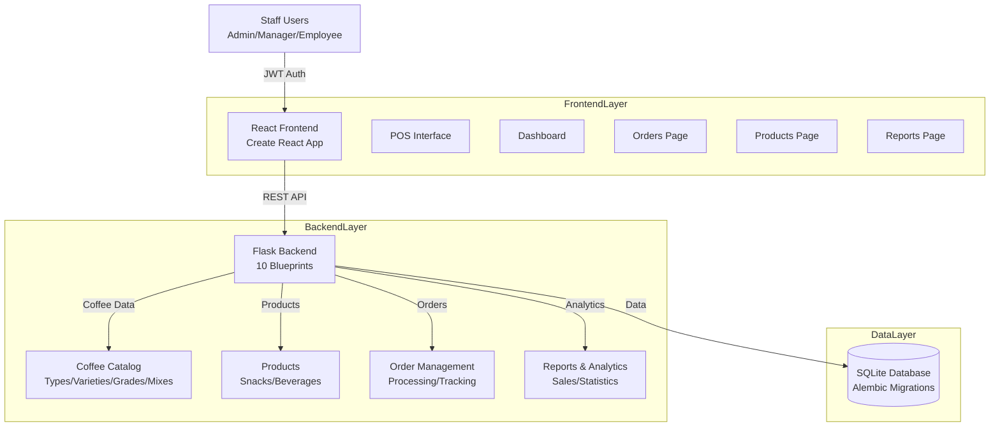
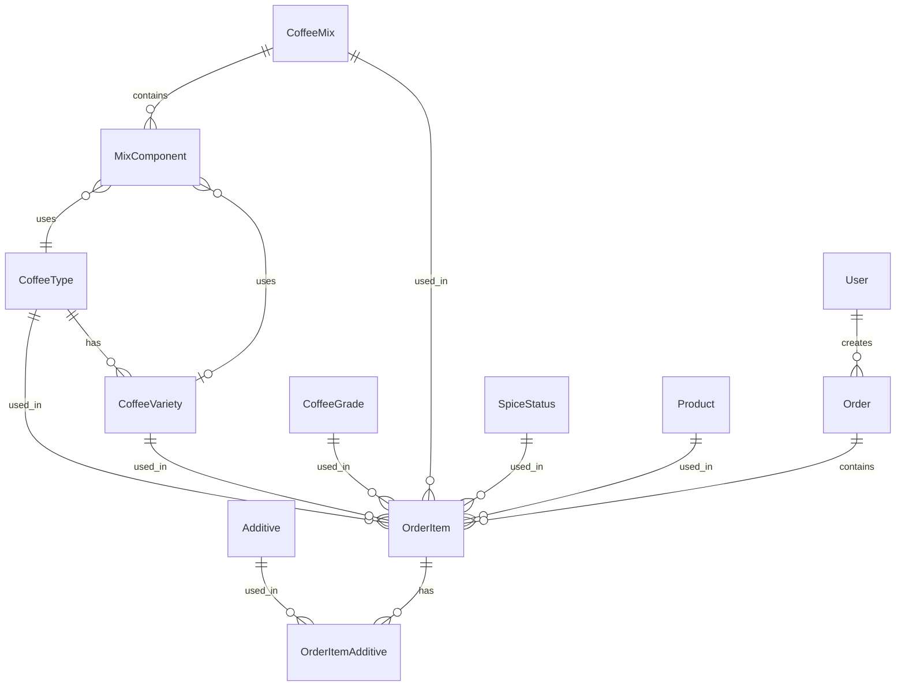
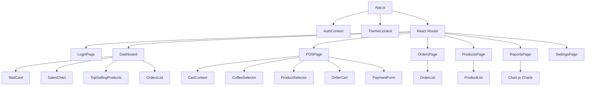
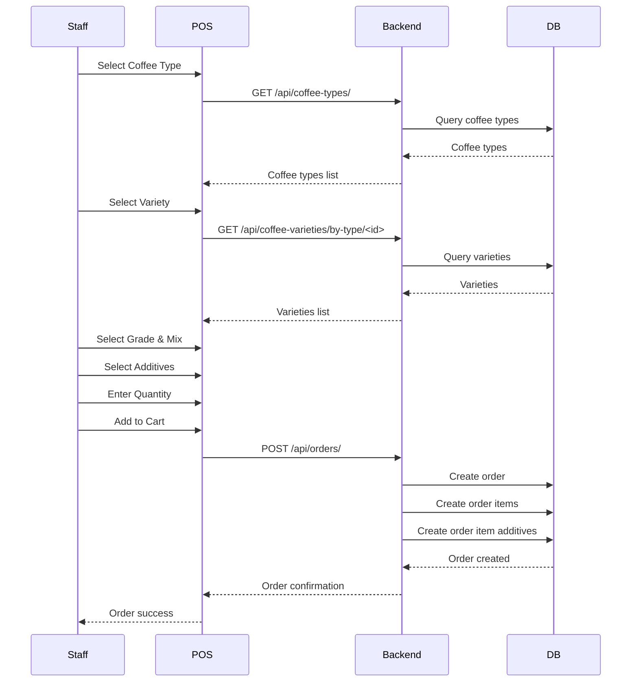
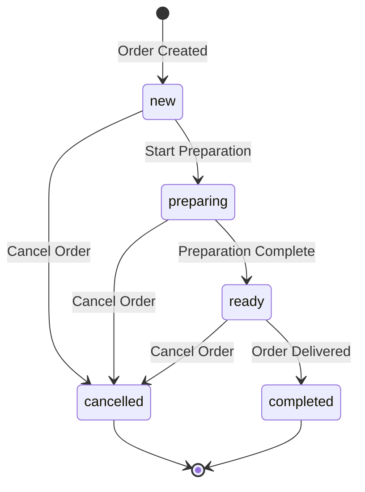

# ☕ Alqaid Coffee POS - Complete Coffee Shop Management System

> **Full-Stack Point of Sale System: Specialized Coffee Shop Management**

```
╔══════════════════════════════════════════════════════════════╗
║                                                              ║
║         ALQAID COFFEE POS - COMPLETE SYSTEM                  ║
║                                                              ║
║     Coffee Shop Point of Sale with Specialized Management   ║
║                                                              ║
╚══════════════════════════════════════════════════════════════╝
```

## 🌟 Project Overview

**Project Name:** Alqaid Coffee POS (alqaid-coffee-pos)  
**Status:** Production System (Client Project)  
**Created:** Active Development  
**Repository Location:** `d:/Projects/Web/cofee`  
**Complexity:** ⭐⭐⭐⭐ (High - Specialized Domain System)

### **Core Description**

> "Full-stack coffee shop Point of Sale (POS) system with specialized coffee management features. Built with Flask backend and React frontend, featuring comprehensive coffee catalog management (types, varieties, grades, mixes), order processing, product management, additives system, dashboard analytics, and reporting. Designed specifically for coffee shop operations with Arabic language support."

### **Key Characteristics**

- **Specialized Domain:** Coffee shop POS system with complex coffee catalog
- **Full-Stack Architecture:** Flask API + React SPA
- **Coffee Management:** Types, varieties, grades, mixes, spice status, additives
- **POS System:** Point of Sale interface with cart, payment processing
- **Order Management:** Complete order lifecycle with status tracking
- **Analytics & Reports:** Dashboard with Chart.js visualizations
- **Arabic Support:** Native RTL support with Arabic UI

---

## 🏗️ Architecture

### **System Architecture**



### **Technology Stack**

**Backend:**
- **Framework:** Flask 2.3.3
- **ORM:** SQLAlchemy 2.0.20
- **Database:** SQLite (alqaid-dev.db) with Alembic migrations
- **Authentication:** Flask-JWT-Extended 4.5.2 (JWT tokens)
- **Password Security:** Passlib 1.7.4 (PBKDF2-SHA256)
- **CORS:** Flask-CORS 4.0.0
- **Validation:** Marshmallow 3.20.1
- **Image Processing:** Pillow 10.0.0
- **Server:** Gunicorn 21.2.0 (production)

**Frontend:**
- **Framework:** React 18.3.1
- **Build Tool:** Create React App 5.0.1
- **HTTP Client:** Axios 1.3.4
- **Routing:** React Router DOM 6.8.2
- **Charts:** Chart.js 4.2.1 + React-ChartJS-2 5.2.0
- **Icons:** React Icons 4.8.0
- **Notifications:** React Toastify 9.1.1
- **Styling:** CSS Modules + Custom CSS

**Development Tools:**
- **Database Migrations:** Flask-Migrate (Alembic)
- **Testing:** Pytest 7.4.0 + Pytest-Flask 1.2.0
- **Environment:** Python-Dotenv 1.0.0

---

## 📁 Project Structure

### **Backend Structure**

```
backend/
├── app.py                    # Flask application factory
├── config.py                 # Configuration classes
├── commands.py               # CLI commands
├── requirements.txt          # Python dependencies
├── models/                   # SQLAlchemy models
│   ├── __init__.py
│   ├── user.py              # User model (JWT auth)
│   ├── coffee_type.py       # Coffee types (أنواع البن)
│   ├── coffee_variety.py    # Coffee varieties (أصناف البن)
│   ├── coffee_grade.py      # Coffee grades (درجات الطحن)
│   ├── coffee_mix.py        # Coffee mixes (ميكسات البن)
│   ├── mix_component.py     # Mix components
│   ├── spice_status.py      # Spice status (حالة التحويج)
│   ├── additive.py          # Additives (الإضافات)
│   ├── product.py           # Products (منتجات إضافية)
│   ├── order.py             # Orders (الطلبات)
│   ├── order_item.py        # Order items
│   └── order_item_additive.py # Order item additives
├── routes/                   # Flask blueprints
│   ├── auth.py              # Authentication routes
│   ├── coffee_types.py      # Coffee types API
│   ├── coffee_varieties.py  # Coffee varieties API
│   ├── coffee_grades.py     # Coffee grades API
│   ├── coffee_mixes.py      # Coffee mixes API
│   ├── spice_status.py      # Spice status API
│   ├── additives.py         # Additives API
│   ├── products.py          # Products API
│   ├── orders.py            # Orders API
│   └── reports.py           # Reports API
├── database/                # SQLite database
│   └── alqaid-dev.db
├── migrations/              # Alembic migrations
│   ├── alembic.ini
│   ├── env.py
│   └── versions/
└── uploads/                 # File uploads
```

### **Frontend Structure**

```
frontend/
├── package.json
├── public/
│   ├── index.html
│   └── manifest.json
└── src/
    ├── App.js               # Main app component
    ├── index.js             # Entry point
    ├── components/
    │   ├── common/          # Reusable components
    │   │   ├── Button.js
    │   │   ├── Card.js
    │   │   ├── Loading.js
    │   │   ├── Navbar.js
    │   │   └── Sidebar.js
    │   ├── dashboard/      # Dashboard components
    │   │   ├── StatCard.js
    │   │   ├── SalesChart.js
    │   │   ├── TopSellingProducts.js
    │   │   └── OrdersList.js
    │   └── pos/             # POS components
    │       ├── CoffeeSelector.js
    │       ├── ProductSelector.js
    │       ├── OrderCart.js
    │       └── PaymentForm.js
    ├── pages/               # Page components
    │   ├── Dashboard.js
    │   ├── POSPage.js
    │   ├── OrdersPage.js
    │   ├── ProductsPage.js
    │   ├── ReportsPage.js
    │   ├── SettingsPage.js
    │   └── LoginPage.js
    ├── contexts/            # React contexts
    │   ├── AuthContext.js
    │   ├── CartContext.js
    │   └── ThemeContext.js
    ├── hooks/               # Custom hooks
    │   ├── useAuth.js
    │   ├── useCart.js
    │   └── useTheme.js
    ├── services/            # API services
    │   ├── api.js           # Axios instance
    │   ├── auth-service.js
    │   ├── coffee-service.js
    │   ├── order-service.js
    │   └── product-service.js
    ├── utils/               # Utilities
    │   ├── constants.js
    │   ├── formatters.js
    │   └── validators.js
    └── assets/
        └── styles/          # Global styles
            ├── App.css
            ├── index.css
            ├── themes.css
            └── variables.css
```

---

## 🔑 Core Features

### **1. Coffee Management System**

**Coffee Types (أنواع البن):**
- Coffee type catalog (e.g., Arabica, Robusta)
- Price per kilogram
- Active/inactive status
- Description and metadata

**Coffee Varieties (أصناف البن):**
- Varieties within each type
- Price adjustments per variety
- Linked to coffee types
- Active/inactive status

**Coffee Grades (درجات الطحن):**
- Grinding grades (fine, medium, coarse)
- Price adjustments per grade
- Active/inactive status

**Coffee Mixes (ميكسات البن):**
- Pre-configured coffee blends
- Mix components (multiple coffee types/varieties)
- Price per kilogram
- Component percentages

**Spice Status (حالة التحويج):**
- Spice status options (spiced, unspiced)
- Price adjustments
- Active/inactive status

**Additives (الإضافات):**
- Additives catalog (cardamom, cloves, etc.)
- Individual pricing
- Active/inactive status

### **2. Point of Sale (POS) System**

**Coffee Selection:**
- Multi-step coffee selection (type → variety → grade → mix)
- Spice status selection
- Additives selection (multiple)
- Quantity input (grams/kilograms)
- Notes field

**Product Selection:**
- Product catalog browsing
- Category filtering
- Quick add to cart
- Quantity selection

**Order Cart:**
- Real-time cart updates
- Item quantity management
- Price calculations
- Additives per item
- Customer name input
- Order type (takeaway/dine-in)
- Notes field

**Payment Processing:**
- Payment method selection (cash, card, wallet)
- Subtotal, tax, total calculations
- Order number generation
- Receipt generation

### **3. Order Management**

**Order Lifecycle:**
- **new:** New order created
- **preparing:** Order in preparation
- **ready:** Order ready for pickup/delivery
- **completed:** Order completed
- **cancelled:** Order cancelled

**Order Features:**
- Order number generation (unique)
- Customer name tracking
- Order type (takeaway/dine-in)
- Payment method tracking
- Status updates
- Order history
- Filtering and search
- Date range filtering
- Status filtering

**Order Items:**
- Coffee items with full specifications
- Product items
- Quantity and unit tracking
- Price per item
- Additives per item
- Notes per item

### **4. Product Management**

**Product Catalog:**
- Product CRUD operations
- Product categories
- Pricing management
- Image uploads
- Active/inactive status
- Description and metadata

**Product Categories:**
- Category-based organization
- Category filtering
- Category management

### **5. Dashboard & Analytics**

**Statistics Cards:**
- Total sales
- Total orders
- Average order value
- Active orders count

**Sales Charts:**
- Sales over time (Chart.js Line chart)
- Sales by day/week/month
- Revenue trends
- Timeframe filtering (today, week, month, custom)

**Top Selling Products:**
- Best selling products list
- Sales quantity
- Revenue per product
- Timeframe filtering

**Active Orders:**
- Real-time active orders list
- Order status indicators
- Quick status updates
- Order details view

### **6. Reports System**

**Sales Reports:**
- Sales by date range
- Sales by product
- Sales by coffee type
- Revenue analysis
- Order count analysis

**Charts:**
- Bar charts (sales by category)
- Line charts (sales trends)
- Pie charts (sales distribution)
- Custom date range selection

**Export:**
- Report generation
- Data export capabilities

### **7. User Management**

**Authentication:**
- JWT-based authentication
- Login/logout
- Token refresh
- Password hashing (PBKDF2-SHA256)

**User Roles:**
- **admin:** Full system access
- **manager:** Management access
- **employee:** Limited access

**User Features:**
- User CRUD operations
- Role management
- Active/inactive status
- Username and email

### **8. Theme System**

**Theme Support:**
- Light/dark theme
- Theme context
- Theme persistence
- System theme detection

---

## 🗄️ Database Schema

### **Core Tables**

**Users:**
- `id` (Primary Key)
- `username` (Unique)
- `password_hash`
- `name`
- `email` (Unique, nullable)
- `role` (admin, manager, employee)
- `is_active`
- `created_at`, `updated_at`

**Coffee Types:**
- `id` (Primary Key)
- `name`
- `description`
- `price_per_kg`
- `active`
- `created_at`, `updated_at`

**Coffee Varieties:**
- `id` (Primary Key)
- `coffee_type_id` (Foreign Key)
- `name`
- `description`
- `price_adjustment`
- `active`
- `created_at`, `updated_at`

**Coffee Grades:**
- `id` (Primary Key)
- `name`
- `description`
- `price_adjustment`
- `active`
- `created_at`, `updated_at`

**Coffee Mixes:**
- `id` (Primary Key)
- `name`
- `description`
- `price_per_kg`
- `active`
- `created_at`, `updated_at`

**Mix Components:**
- `id` (Primary Key)
- `mix_id` (Foreign Key)
- `coffee_type_id` (Foreign Key)
- `coffee_variety_id` (Foreign Key, nullable)
- `percentage`
- `created_at`, `updated_at`

**Spice Status:**
- `id` (Primary Key)
- `name`
- `description`
- `price_adjustment`
- `active`
- `created_at`, `updated_at`

**Additives:**
- `id` (Primary Key)
- `name`
- `description`
- `price`
- `active`
- `created_at`, `updated_at`

**Products:**
- `id` (Primary Key)
- `name`
- `description`
- `price`
- `category`
- `image_url`
- `active`
- `created_at`, `updated_at`

**Orders:**
- `id` (Primary Key)
- `order_number` (Unique)
- `customer_name`
- `order_type` (takeaway, dine-in)
- `subtotal`
- `tax`
- `total_amount`
- `payment_method` (cash, card, wallet)
- `payment_details` (JSON)
- `status` (new, preparing, ready, completed, cancelled)
- `notes`
- `created_at`, `updated_at`

**Order Items:**
- `id` (Primary Key)
- `order_id` (Foreign Key)
- `item_type` (coffee, product)
- `coffee_type_id` (Foreign Key, nullable)
- `coffee_variety_id` (Foreign Key, nullable)
- `coffee_grade_id` (Foreign Key, nullable)
- `coffee_mix_id` (Foreign Key, nullable)
- `spice_status_id` (Foreign Key, nullable)
- `product_id` (Foreign Key, nullable)
- `quantity`
- `unit` (جرام, كجم, قطعة)
- `price`
- `notes`
- `created_at`, `updated_at`

**Order Item Additives:**
- `id` (Primary Key)
- `order_item_id` (Foreign Key)
- `additive_id` (Foreign Key)
- `quantity`
- `price`
- `created_at`, `updated_at`

### **Database Relationships**



---

## 🔌 API Endpoints

### **Authentication**

- `POST /api/auth/login` - User login
- `POST /api/auth/logout` - User logout
- `POST /api/auth/refresh` - Refresh JWT token
- `GET /api/auth/me` - Get current user

### **Coffee Types**

- `GET /api/coffee-types/` - List all coffee types
- `GET /api/coffee-types/<id>` - Get coffee type by ID
- `POST /api/coffee-types/` - Create coffee type
- `PUT /api/coffee-types/<id>` - Update coffee type
- `DELETE /api/coffee-types/<id>` - Delete coffee type

### **Coffee Varieties**

- `GET /api/coffee-varieties/` - List all coffee varieties
- `GET /api/coffee-varieties/by-type/<type_id>` - Get varieties by type
- `GET /api/coffee-varieties/<id>` - Get coffee variety by ID
- `POST /api/coffee-varieties/` - Create coffee variety
- `PUT /api/coffee-varieties/<id>` - Update coffee variety
- `DELETE /api/coffee-varieties/<id>` - Delete coffee variety

### **Coffee Grades**

- `GET /api/coffee-grades/` - List all coffee grades
- `GET /api/coffee-grades/<id>` - Get coffee grade by ID
- `POST /api/coffee-grades/` - Create coffee grade
- `PUT /api/coffee-grades/<id>` - Update coffee grade
- `DELETE /api/coffee-grades/<id>` - Delete coffee grade

### **Coffee Mixes**

- `GET /api/coffee-mixes/` - List all coffee mixes
- `GET /api/coffee-mixes/<id>` - Get coffee mix by ID
- `GET /api/coffee-mixes/<id>/components` - Get mix components
- `POST /api/coffee-mixes/` - Create coffee mix
- `POST /api/coffee-mixes/<id>/components` - Add mix component
- `PUT /api/coffee-mixes/<id>` - Update coffee mix
- `DELETE /api/coffee-mixes/<id>` - Delete coffee mix

### **Spice Status**

- `GET /api/spice-status/` - List all spice statuses
- `GET /api/spice-status/<id>` - Get spice status by ID
- `POST /api/spice-status/` - Create spice status
- `PUT /api/spice-status/<id>` - Update spice status
- `DELETE /api/spice-status/<id>` - Delete spice status

### **Additives**

- `GET /api/additives/` - List all additives
- `GET /api/additives/<id>` - Get additive by ID
- `POST /api/additives/` - Create additive
- `PUT /api/additives/<id>` - Update additive
- `DELETE /api/additives/<id>` - Delete additive

### **Products**

- `GET /api/products/` - List all products
- `GET /api/products/<id>` - Get product by ID
- `POST /api/products/` - Create product
- `PUT /api/products/<id>` - Update product
- `DELETE /api/products/<id>` - Delete product
- `GET /api/products/top-selling` - Get top selling products

### **Orders**

- `GET /api/orders/` - List all orders (with filters)
- `GET /api/orders/<id>` - Get order by ID
- `POST /api/orders/` - Create new order
- `PUT /api/orders/<id>` - Update order
- `PUT /api/orders/<id>/status` - Update order status
- `DELETE /api/orders/<id>` - Delete order
- `GET /api/orders/stats` - Get order statistics
- `GET /api/orders/by-status/<status>` - Get orders by status

### **Reports**

- `GET /api/reports/sales` - Get sales report
- `GET /api/reports/products` - Get product report
- `GET /api/reports/coffee` - Get coffee report

---

## 🎨 Frontend Architecture

### **Component Hierarchy**



### **State Management**

**Context API:**
- **AuthContext:** User authentication state
- **CartContext:** Shopping cart state
- **ThemeContext:** Theme preferences

**Custom Hooks:**
- **useAuth:** Authentication logic
- **useCart:** Cart management logic
- **useTheme:** Theme management logic

### **Service Layer**

**API Services:**
- **api.js:** Axios instance with JWT interceptors
- **auth-service.js:** Authentication API calls
- **coffee-service.js:** Coffee catalog API calls
- **order-service.js:** Order management API calls
- **product-service.js:** Product management API calls

### **Styling**

**CSS Architecture:**
- Component-level CSS modules
- Global styles in `assets/styles/`
- Theme variables in `variables.css`
- Theme-specific styles in `themes.css`

---

## 🔐 Security Features

### **Authentication**

- **JWT Tokens:** Access and refresh tokens
- **Token Expiration:** Configurable expiration times
- **Password Hashing:** PBKDF2-SHA256 (Passlib)
- **Token Refresh:** Automatic token refresh mechanism

### **Authorization**

- **Role-Based Access:** Admin, manager, employee roles
- **Route Protection:** Protected routes with JWT validation
- **API Protection:** JWT-required endpoints

### **Data Validation**

- **Input Validation:** Marshmallow schemas
- **SQL Injection Prevention:** SQLAlchemy ORM
- **XSS Prevention:** Input sanitization

---

## 📊 Key Workflows

### **Coffee Order Workflow**



### **Order Status Workflow**



---

## 🚀 Deployment

### **Backend Deployment**

**Development:**
```bash
python app.py
# Runs on http://0.0.0.0:5000
```

**Production:**
```bash
gunicorn -w 4 -b 0.0.0.0:5000 app:app
```

### **Frontend Deployment**

**Development:**
```bash
npm start
# Runs on http://localhost:3000
```

**Production:**
```bash
npm run build
# Builds to build/ directory
```

### **Database Migrations**

```bash
# Create migration
flask db migrate -m "Description"

# Apply migration
flask db upgrade

# Rollback migration
flask db downgrade
```

---

## 📈 Performance Considerations

### **Backend Optimizations**

- **Database Indexing:** Indexed foreign keys and frequently queried fields
- **Query Optimization:** Eager loading for relationships
- **Connection Pooling:** SQLAlchemy connection pooling
- **Caching:** Consider Redis for frequently accessed data

### **Frontend Optimizations**

- **Code Splitting:** React lazy loading for routes
- **Image Optimization:** Optimized product images
- **Bundle Size:** Tree shaking and minification
- **Chart Performance:** Chart.js with optimized datasets

---

## 🧪 Testing

### **Backend Testing**

```bash
# Run tests
pytest

# Run with coverage
pytest --cov=app tests/
```

### **Frontend Testing**

```bash
# Run tests
npm test

# Run with coverage
npm test -- --coverage
```

---

## 📝 Development Notes

### **Coffee Catalog Complexity**

The coffee management system is highly specialized with multiple layers:
- **Types:** Base coffee types (Arabica, Robusta)
- **Varieties:** Sub-types within each type
- **Grades:** Grinding grades (fine, medium, coarse)
- **Mixes:** Pre-configured blends with components
- **Spice Status:** Spicing options
- **Additives:** Additional flavorings

This complexity requires careful UI/UX design to make selection intuitive.

### **Order Item Structure**

Order items can be either:
- **Coffee items:** Require type, variety, grade, mix, spice status, additives
- **Product items:** Simple product selection with quantity

This dual structure requires flexible data modeling.

### **Arabic Language Support**

The entire system is designed for Arabic language:
- RTL layout support
- Arabic text throughout UI
- Arabic database field names (in comments)
- Arabic error messages

---

## 🔗 Related Projects

- **Hvar-Hub:** Similar full-stack architecture (Flask + React)
- **Shozati (Trendy Corner):** Similar e-commerce patterns
- **Ramadan Store:** Similar order management patterns

---

## 📚 Key Learnings

1. **Specialized Domain Modeling:** Complex coffee catalog requires careful data modeling
2. **POS System Design:** Real-time cart updates and payment processing
3. **Full-Stack Integration:** Seamless Flask + React integration
4. **Arabic/RTL Support:** Complete RTL layout implementation
5. **Chart.js Integration:** Data visualization with Chart.js
6. **JWT Authentication:** Secure token-based authentication
7. **Order Lifecycle:** State machine for order status management

---

## 🎯 Project Significance

**Why This Project Matters:**

1. **Specialized Domain:** Coffee shop POS system with unique requirements
2. **Full-Stack Expertise:** Demonstrates Flask + React integration
3. **Complex Data Model:** Multi-layered coffee catalog management
4. **Business Application:** Real-world client project
5. **Arabic Support:** Complete RTL and Arabic language implementation
6. **POS System:** Point of Sale functionality with payment processing
7. **Analytics:** Dashboard with comprehensive reporting

---

**Made with ❤️ for Alqaid Coffee Shop**

