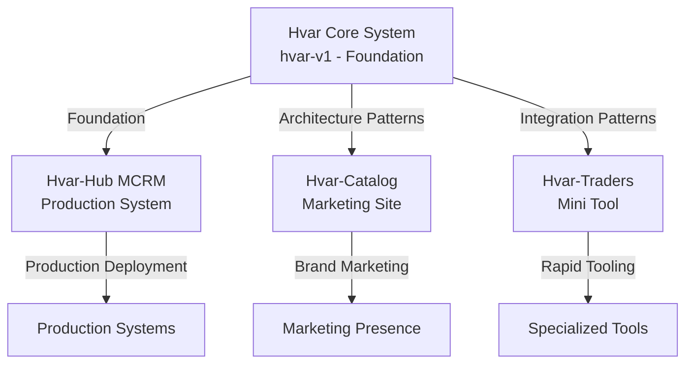

# 🗺️ Project Relationships - Your Knowledge Graph

> **How Your Projects Connect - The Big Picture**

```
╔══════════════════════════════════════════════════════════════╗
║                                                              ║
║              PROJECT RELATIONSHIP MAP                         ║
║                                                              ║
║     How Everything Connects - Your Ecosystem View           ║
║                                                              ║
╚══════════════════════════════════════════════════════════════╝
```

## 🌐 The Big Picture

Your **75+ projects** aren't isolated - they form **ecosystems**, **families**, and **evolutionary lines**. Understanding these relationships reveals your **thinking patterns** and **strategic approach**.

---

## 🏗️ Major Ecosystems

### **1. GeoLink Ecosystem** 🗺️

**Core:** GeoLink V1 (Production API Platform - www.geolink-eg.com)
**Production Metrics:** ~5 million requests/month, serving 50+ clients (startups, real projects, developers)

**Related Projects:**
- Legacy versions (v1, v2, backend-only, frontend-only variants)
- Framework variants (Flask-specific implementations)
- Regional variants (Egypt-specific versions)
- Dashboard systems (public dashboards with backend and orders management)
- Mobile integrations:
  - Areo (Trip tracking)
  - Dinamo/Go_User (Custom GeoLink API integration)
  - Taxiarab_ANDROID (GeoLink API integration)

**Relationship:**
```
GeoLink V1 (Production API Platform)
    ├── Production: www.geolink-eg.com (5M+ req/month, 50+ clients)
    ├── Full-Stack: Flask 3.0.3 + React 18.3.1
    ├── Billing System: Credit-based with free quotas
    │
    ├── Legacy/Related Versions (v1, v2, backend-only, frontend-only, framework variants, regional versions)
    ├── Dashboard Systems (public dashboards with backend and orders management)
    │
    └── Mobile Integrations:
        ├── Areo (Trip tracking)
        ├── Dinamo/Go_User (Custom GeoLink API integration)
        └── Taxiarab_ANDROID (GeoLink API integration)
```

**Pattern:** **Ecosystem Building**
- One core concept
- Multiple implementations
- Frontend + Backend + Mobile
- Public + Private versions

### **2. Hub Systems Ecosystem** 🏢

**Core:** Hvar-Hub (Flagship) + Hvar Core System (Foundation)
**Related Projects:**
- Hvar Core System (hvar-v1) - Foundational platform
- Hvar-Hub (MCRM) - Production service management system
- Hvar-Catalog (Marketing site - Product catalog)
- Hvar-Traders (Mini tool - Trader management)
- Pigo-Hub (Alternative hub)
- hvar-traders-management (Module)
- Spice-Hub (Android hub)
- bosta-crm (CRM system)

**Relationship:**


**Pattern:** **Ecosystem Building**
- **Foundation First:** Core System (hvar-v1) provides architectural foundation
- **Production System:** Hvar-Hub MCRM builds upon Core System patterns
- **Marketing Presence:** Hvar-Catalog - brand/marketing
- **Specialized Tools:** Hvar-Traders - rapid tooling
- **Related Modules:** Multiple integrations and variants
- **Flexible Architecture:** Core System designed to accommodate all future systems

### **3. E-Commerce Ecosystem** 🛒

**Core:** ramadan-store (Client-facing store)
**Related Projects:**
- ramadan-store-admin (Admin dashboard panel)
- Shozati/Trendy Corner (Full-Stack Production E-Commerce)
- MarketBelbeis (Early version)
- MarketBelbeisSeller (Seller app)

**Relationship:**
```
MarketBelbeis (2021 - Android Marketplace)
    └── MarketBelbeisSeller (Seller app)
        ↓ (Evolution/Inspiration)
ramadan-store + ramadan-store-admin (January 2025 - Seasonal E-Commerce System, Dual-App: React + Vite + Tailwind CSS)
    └── Shozati/Trendy Corner (2025 - Full-Stack Production E-Commerce)
        - React 18.3.1 + Flask backend
        - Production deployed (trendy-corner.org)
        - Complete admin dashboard with analytics
        - Bilingual Arabic/English
```

**Note:** Shozati represents evolution from simple stores to comprehensive full-stack production e-commerce with advanced features

**Specialized Systems:**
- **Alqaid Coffee POS** (Active Development) - Full-stack coffee shop Point of Sale system
  - Flask 2.3.3 + React 18.3.1 (Create React App)
  - Specialized coffee management (types, varieties, grades, mixes, spice status, additives)
  - POS system with order processing, payment handling, dashboard analytics
  - Client project for Alqaid coffee shop
  - Demonstrates specialized domain modeling and full-stack Flask + React integration

**Pattern:** **Platform Evolution & Cross-Platform Learning**
- **Foundation Phase (2019-2021):**
  - MarketBelbeis (2021) - Early Android marketplace (Java + early Kotlin)
  - MarketBelbeisSeller (2021) - Seller-facing Android app
  - [Scriptor](../03-Projects-Deep-Dive/Mobile-Apps/04-Scriptor-Complete.md) (2021) - Creative writing platform (Java, Firebase, MVC)
- Later evolution to web-based stores (ramadan-store, Shozati/Trendy Corner)
- Marketplace concepts applied across platforms (Android → Web)
- Learning foundation that informed future e-commerce projects
- **Shozati** represents full-stack production evolution (React + Flask, comprehensive features, production deployment)

### **4. Transportation & Mobile Apps Ecosystem** 📱

**Core:** Transportation Apps (Areo, Dinamo, Taxiarab_ANDROID)
**Related Projects:**
- Areo (Trip management - Pilots/Drivers)
- Dinamo (Go_Driver + Go_User - Ride-sharing & Delivery)
- Taxiarab_ANDROID (Client + Driver - Modern ride-sharing platform)
- snapupdate (Update system)
- number-converter-app (First Kotlin project, Utility - Number base conversion)
- Aero-Demo (Demo version)

**Relationship:**
```
Transportation Apps
    ├── Areo (Trip Management - Pilots/Drivers)
    │   ├── Aero-Demo
    │   └── Geolink API integration (Geofire)
    │
    └── Dinamo (Dual-App Ride-Sharing & Delivery Platform)
        ├── Go_Driver (Driver-facing app)
        │   ├── LocationTrackingService (5s interval, 10m displacement)
        │   ├── TripFetchService + TripFetchWorker (30s polling)
        │   └── ObjectBox + Realm for local storage
        ├── Go_User (User-facing app)
        │   ├── Geolink API integration (wasalni_rider package)
        │   ├── Saved Places feature (August 2023)
        │   ├── Search API V2 (September 2023)
        │   └── RxJava 3 reactive programming
        ├── Shared Backend API
        │   └── Dashboard API endpoints (dashboard.dinamo-app.com)
        ├── Geolink API Integration
        │   ├── GeolinkApiService with dynamic key retrieval
        │   ├── Production use as alternative to Google Places API
        │   ├── 4 endpoints: geocode, reverseGeocode, directions, textSearch
        │   └── Integrated in CarViewModel, ProgressActivity, DetailsHistoryActivity
        └── Product Flavors (go/wasalni brands, dev/prod environments)
            ├── 4 build variants per app (goDev/goProd/wasalniDev/wasalniProd)
            ├── Different package names and endpoints per variant
            └── Brand-specific and environment-specific configurations
    
    └── Utilities
        ├── snapupdate (Update framework)
        └── number-converter-app (First Kotlin project, Utility - Number base conversion)
```

**Pattern:** **Domain Focus & Dual-App Architecture**
- Transportation focus (trip management, ride-sharing, delivery)
- Dual-app systems (driver + user apps with shared backend)
- Real-time location tracking expertise (5-second interval updates)
- Custom Geolink API integration in production (wasalni_rider package)
- Two-layer background processing (Foreground Service + WorkManager)
- Location-based trip fetching with ignored orders management
- Multi-brand product flavor support (go/wasalni × dev/prod = 4 variants per app)
- Production timeline: Jul 2023 - Jan 2025 (1 year 7 months active development)
- Version evolution: versionCode 83 Driver / 116 User
- Related utilities and framework development

---

## 🔄 Evolutionary Lines

### **Geolocation Evolution**

**Line 1: Geolink**
```
Geolink-v1 (Private)
    ↓
Geolink (Public API) ← 8 stars
    ↓
Geolink-v2 (Private - Enhanced)
    ↓
Geolink-Flask (Framework variant)
```

**Line 2: GeoEgy**
```
GeoEgy-BackEnd
    ↓
GeoEgy-Orders-Backend
    ↓
GeoEgy (Dashboard) ← Public
```

**Pattern:** **Continuous Evolution**
- Start private
- Go public
- Enhance private
- Create variants

### **Hub Systems Evolution**

**Line:**
```
MarketBelbeis (Early)
    ↓
Spice-Hub (Android)
    ↓
Pigo-Hub (Web)
    ↓
Hvar-Hub (Flagship - Complete)
```

**Pattern:** **Complexity Growth**
- Simple → Complex
- Single → Multi-module
- Basic → Production

### **Mobile Evolution**

**Line:**
```
Java Apps (Early - Foundation Phase 2019-2021)
    ├── MarketBelbeis (Marketplace)
    ├── MarketBelbeisSeller (Seller app)
    └── Scriptor (Creative writing platform)
        ↓
Kotlin Apps (Transition 2021-2023)
    ↓
Modern Android (Material 3)
    ↓
Cross-Platform (Flutter exploration)
```

**Pattern:** **Technology Evolution**
- Java → Kotlin
- Basic → Modern
- Native → Cross-platform
- **Foundation Phase:** Scriptor (Firebase integration, MVC pattern, content platform) represents early Android learning with Firebase backend

---

## 🔗 Technology Connections

### **Flask + React Pattern**

**Projects Using This:**
- Hvar-Hub (Flagship)
- Related business systems

**Connection:**
- Flask backend
- React frontend
- MySQL database
- Production deployment

**Why This Pattern:**
- Full-stack capability
- Modern stack
- Production-ready
- Scalable architecture

### **Google Maps Integration**

**Projects Using This:**
- Geolink (all versions)
- GeoEgy
- Areo (Google Maps SDK 18.2.0)
- Dinamo (Google Maps SDK 17.0.0, also uses custom Geolink API)
- geolink-eg

**Connection:**
- Google Maps API (primary mapping and location services)
- Custom Geolink API (Dinamo wasalni_rider package - alternative to Google Places)
- Location services (high-accuracy tracking, geofencing, real-time updates)
- Mapping features (route visualization, marker management, custom styling)
- Directions/geocoding (Google Maps + custom Geolink API integration)

**Why This Pattern:**
- Specialization in location-based services
- Reusability across projects
- Domain expertise in transportation and geolocation
- Consistent approach with flexibility for custom solutions
- Production use of both Google Maps and custom Geolink API

### **Arabic/RTL Pattern**

**Projects Using This:**
- Hvar-Hub
- GeoEgy

**Connection:**
- Arabic language
- RTL layout
- Cultural context
- Market focus

**Why This Pattern:**
- Market specialization
- Unique skill
- Competitive advantage
- User experience

---

## 🎯 Knowledge Flow

### **How Knowledge Flows Between Projects**

**Geolocation → Business Systems:**
- Location features in business apps
- Maps integration
- Location-based services

**Mobile → Web:**
- Mobile patterns → Web patterns
- Component reuse
- Design system sharing

**Backend → Frontend:**
- API design → Frontend consumption
- Data models → UI components
- Business logic → User experience

**Learning → Production:**
- Learning projects → Production patterns
- Experimentation → Best practices
- Prototypes → Production systems

---

## 💡 Relationship Insights

### **What Relationships Reveal**

**1. Ecosystem Thinking**
- Projects aren't isolated
- Build ecosystems, not just apps
- Related projects support each other
- Platform mindset

**2. Evolution Mindset**
- Projects evolve
- Learn from each project
- Build on previous work
- Continuous improvement

**3. Domain Focus**
- Specialization areas
- Deep expertise
- Related projects
- Domain mastery

**4. Technology Patterns**
- Preferred stacks
- Reusable patterns
- Consistent approaches
- Technology mastery

---

## 🗺️ Visual Knowledge Map

### **Core Domains**

```
Geolocation (10+ projects)
    ├── APIs
    ├── Dashboards
    ├── Mobile Apps
    └── Backend Services

Business Systems (5+ projects)
    ├── Hub Systems
    ├── CRM
    ├── Inventory
    └── Service Management

Mobile Development (15+ projects)
    ├── Android Apps
    ├── Utilities
    ├── Components
    └── Frameworks

E-Commerce (5+ projects)
    ├── Stores
    ├── Admin Panels
    ├── Marketplaces
    └── POS Systems (Alqaid Coffee POS)
```

### **Technology Connections**

```
Python/Flask
    ├── Geolink APIs
    ├── Business Systems
    └── Backend Services

React/JavaScript
    ├── Business System Frontends
    ├── Dashboards
    ├── E-Commerce
    └── POS Systems (Alqaid Coffee POS)

Kotlin/Android
    ├── Mobile Apps
    │   ├── Transportation (Areo, Dinamo)
    │   ├── Utilities
    │   └── Components
    └── Dual-App Systems (Dinamo - Driver + User apps)

Java/Android (Foundation Phase 2019-2021)
    ├── MarketBelbeis (Marketplace)
    ├── MarketBelbeisSeller (Seller app)
    └── Scriptor (Creative writing platform - Firebase, MVC)

Google Maps API
    ├── Geolink (Backend API)
    ├── GeoEgy (Dashboard)
    ├── Areo (Trip tracking)
    └── Dinamo (Google Maps SDK 17.0.0 + Custom Geolink API integration)
        ├── Google Maps SDK for map visualization
        └── Custom Geolink API (wasalni_rider package) for location services
            ├── Alternative to Google Places API (cost-effective)
            ├── Dynamic API key retrieval from backend
            ├── 4 endpoints: geocode, reverseGeocode, directions, textSearch
            └── Production integration in CarViewModel and activities
```

---

## 🔮 Future Connections

### **Potential Relationships**

**Geolink Platform:**
- API → SDK → Mobile Apps → Dashboard
- Complete ecosystem

**Business Systems Framework:**
- Hvar-Hub → Templates → Industry Versions
- Reusable framework

**Arabic/RTL Tools:**
- RTL Components → Design System → Tools
- Complete toolkit

---

**Understanding relationships reveals your strategic thinking and ecosystem approach.** 🗺️✨

---

*Projects don't exist in isolation - they form your knowledge ecosystem.*

